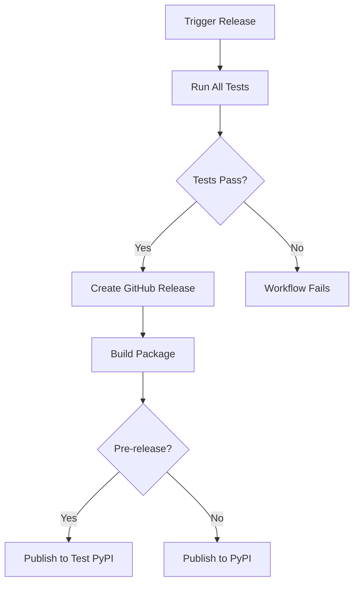

# Release & PyPI Publishing Setup Guide

This guide explains how to configure automated releases and PyPI publishing for Machine Dialect™.

## Prerequisites

1. PyPI account at [pypi.org](https://pypi.org)
2. (Optional) Test PyPI account at [test.pypi.org](https://test.pypi.org)
3. GitHub repository admin access

## Step 1: Create PyPI API Tokens

### Production PyPI Token

1. Log in to [pypi.org](https://pypi.org)
2. Go to Account Settings → API tokens
3. Click "Add API token"
4. Name: `machine-dialect-github-actions`
5. Scope: Choose "Project: machine-dialect" (after first manual upload) or "Entire account"
6. Copy the token (starts with `pypi-`)

### Test PyPI Token (Optional)

1. Log in to [test.pypi.org](https://test.pypi.org)
2. Follow same steps as above
3. Copy the test token

## Step 2: Add GitHub Secrets

1. Go to your GitHub repository
2. Navigate to Settings → Secrets and variables → Actions
3. Click "New repository secret"
4. Add these secrets:
   - Name: `PYPI_API_TOKEN`
     Value: Your PyPI token from Step 1
   - Name: `TEST_PYPI_API_TOKEN` (optional)
     Value: Your Test PyPI token from Step 1

## Step 3: Create GitHub Environment (Optional but Recommended)

1. Go to Settings → Environments
2. Click "New environment"
3. Name: `pypi`
4. Configure protection rules:
   - ✅ Required reviewers (add yourself or team members)
   - ✅ Prevent self-review
   - ✅ Deployment branches: Selected branches → Add rule → `main`
5. Add environment secrets (same as Step 2 but more secure)

## Step 4: First Manual Package Upload (One-time)

Before automation works, you need to manually upload once to claim the package name:

```bash
# Build the package
uv build

# Upload to Test PyPI first (optional)
uv publish --registry test-pypi

# Upload to PyPI
uv publish
```

## How to Create a Release

### Option 1: Manual Release Workflow

1. Go to Actions → Release workflow
2. Click "Run workflow"
3. Enter version (e.g., `v0.1.0`)
4. Check "prerelease" if applicable
5. Click "Run workflow"
6. Tests will run first, then release created if all pass

### Option 2: GitHub UI

1. Go to Releases → "Draft a new release"
2. Create tag: `v0.1.0`
3. Enter release notes
4. Check "Set as pre-release" if applicable
5. Click "Publish release"
6. Tests will run, then package published to PyPI

## Release Process Flow



## Troubleshooting

### "No module named machine_dialect"

- Ensure the package name in `pyproject.toml` matches PyPI

### "Invalid or non-existent authentication"

- Check API token is correctly set in GitHub secrets
- Ensure token has correct scope

### "Package already exists"

- For first release, manually upload once to claim the name
- Use `skip-existing: true` for Test PyPI

### Tests fail on Windows

- Check line endings (use `.gitattributes`)
- Ensure build_vm.sh equivalent works on Windows

## Security Best Practices

1. **Never commit tokens** to the repository
2. **Use environment protection** for production releases
3. **Test with Test PyPI first** before production
4. **Review release notes** before publishing
5. **Keep tokens scoped** to specific projects when possible

## Package Versioning

Follow semantic versioning:

- `v0.1.0` - Initial release
- `v0.1.1` - Patch fixes
- `v0.2.0` - New features
- `v1.0.0` - Major release/breaking changes

Pre-releases:

- `v0.1.0-alpha.1` - Alpha release
- `v0.1.0-beta.1` - Beta release
- `v0.1.0-rc.1` - Release candidate
